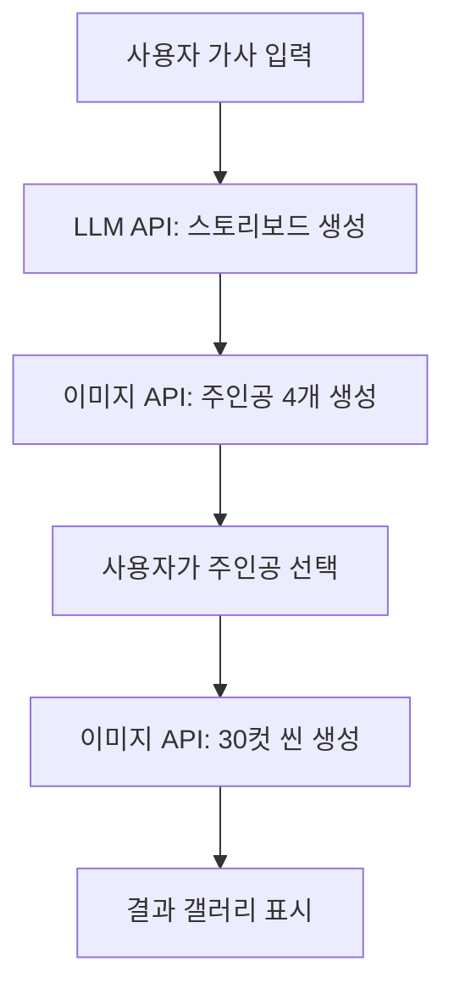

# 🎬 AI Music Video Generator

AI 기술을 활용하여 가사로부터 시네마틱한 뮤직비디오를 자동 생성하는 웹 애플리케이션입니다.

## ✨ 주요 기능

- 🎵 **가사 입력**: Suno 가사를 붙여넣어 시작
- 🤖 **AI 스토리보드 생성**: Gemini LLM이 30개 씬의 스토리보드 자동 생성
- 👤 **주인공 선택**: 4개의 AI 생성 후보 중 원하는 주인공 선택
- 🎨 **일관된 캐릭터**: 선택한 주인공으로 30컷의 일관된 이미지 생성
- 🖼️ **갤러리 뷰**: 생성된 모든 씬을 한눈에 확인
- 🌙 **다크 시네마틱 테마**: 세련된 UI/UX

## 🛠️ 기술 스택

- **Frontend**: Next.js 15, React 18, TypeScript
- **Styling**: Tailwind CSS
- **AI Services**:
  - Gemini Pro (LLM for storyboard generation)
  - Nano Banana Pro (Image generation with character consistency)

## 📋 요구사항

- Node.js 18+ 
- npm 또는 yarn
- Gemini API Key
- Nano Banana API Key

## 🚀 설치 및 실행

### 1. 저장소 클론 및 의존성 설치

```bash
cd /home/user/webapp
npm install
```

### 2. 환경 변수 설정

`.env.local` 파일을 생성하고 API 키를 설정합니다:

```bash
cp .env.example .env.local
```

`.env.local` 파일을 편집하여 실제 API 키를 입력:

```env
GEMINI_API_KEY=your_actual_gemini_api_key
NANOBANANA_API_KEY=your_actual_nanobanana_api_key
```

### 3. 개발 서버 실행

```bash
npm run dev
```

브라우저에서 [http://localhost:3000](http://localhost:3000) 접속

### 4. 프로덕션 빌드

```bash
npm run build
npm start
```

## 📖 사용 방법

1. **가사 입력**: 메인 페이지의 텍스트 영역에 노래 가사를 붙여넣습니다
2. **생성 시작**: "뮤직비디오 생성 시작" 버튼 클릭
3. **주인공 선택**: AI가 생성한 4개의 주인공 후보 중 하나를 선택
4. **대기**: 30개 씬이 생성될 때까지 대기 (약 5-10분)
5. **결과 확인**: 갤러리에서 생성된 뮤직비디오 씬들을 확인

## 🏗️ 프로젝트 구조

```
/home/user/webapp/
├── app/
│   ├── api/
│   │   ├── generate/          # LLM 스토리보드 및 주인공 생성 API
│   │   └── generate-final/    # 30컷 씬 생성 API (SSE)
│   ├── globals.css            # 글로벌 스타일 (다크 시네마틱 테마)
│   ├── layout.tsx             # 루트 레이아웃
│   └── page.tsx               # 메인 페이지
├── components/
│   ├── LyricsInput.tsx        # 가사 입력 컴포넌트
│   ├── ProtagonistSelector.tsx # 주인공 선택 컴포넌트
│   ├── ImageGallery.tsx       # 결과 갤러리 컴포넌트
│   └── LoadingSpinner.tsx     # 로딩 스피너 컴포넌트
├── types/
│   └── index.ts               # TypeScript 타입 정의
├── utils/
│   ├── llmService.ts          # Gemini LLM API 서비스
│   └── imageService.ts        # Nano Banana 이미지 생성 서비스
├── .env.example               # 환경 변수 예제
├── package.json
├── tsconfig.json
├── tailwind.config.ts
└── README.md
```

## 🔑 API 키 발급

### Gemini API Key
1. [Google AI Studio](https://makersuite.google.com/app/apikey) 방문
2. Google 계정으로 로그인
3. "Create API Key" 클릭
4. 생성된 키를 `.env.local`에 복사

### Nano Banana API Key
1. Nano Banana 서비스 웹사이트 방문
2. 계정 생성 및 로그인
3. API 키 발급
4. 생성된 키를 `.env.local`에 복사

## 🔄 워크플로우



### 상세 단계

1. **LLM 스토리보드 생성**
   - 가사 분석
   - 주인공 프롬프트 생성 (2D 스타일, 흰 배경)
   - 30개 씬별 프롬프트 생성 (카메라 앵글, 조명 포함)

2. **주인공 후보 생성**
   - 주인공 프롬프트로 4개 이미지 생성
   - 사용자 선택 대기

3. **최종 씬 생성**
   - 선택된 주인공을 레퍼런스로 사용
   - 각 씬 프롬프트로 Img2Img 생성
   - Character Consistency 유지
   - 실시간 진행 상황 업데이트 (SSE)

## ⚠️ 주의사항

- API 호출에는 비용이 발생할 수 있습니다
- 30개 이미지 생성에 5-10분 정도 소요됩니다
- 안정적인 인터넷 연결이 필요합니다
- Rate limiting을 고려하여 요청 간 딜레이가 있습니다

## 🐛 문제 해결

### "GEMINI_API_KEY is not configured" 오류
- `.env.local` 파일이 프로젝트 루트에 있는지 확인
- API 키가 올바르게 입력되었는지 확인
- 개발 서버를 재시작

### "Failed to generate storyboard" 오류
- Gemini API 키가 유효한지 확인
- API 할당량을 초과하지 않았는지 확인
- 네트워크 연결 상태 확인

### 이미지 생성 실패
- Nano Banana API 키가 유효한지 확인
- API 크레딧이 충분한지 확인
- 브라우저 콘솔에서 상세 오류 확인

## 📝 라이선스

MIT License

## 🤝 기여

이슈와 풀 리퀘스트는 언제나 환영합니다!

## 📧 연락처

문의사항이 있으시면 이슈를 등록해주세요.
